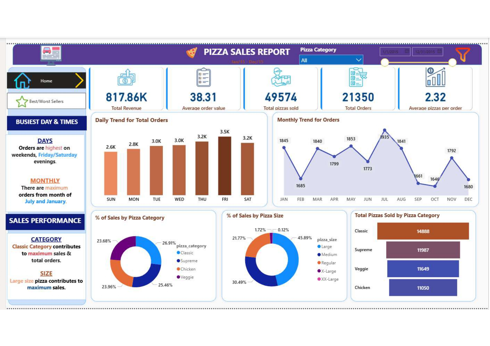
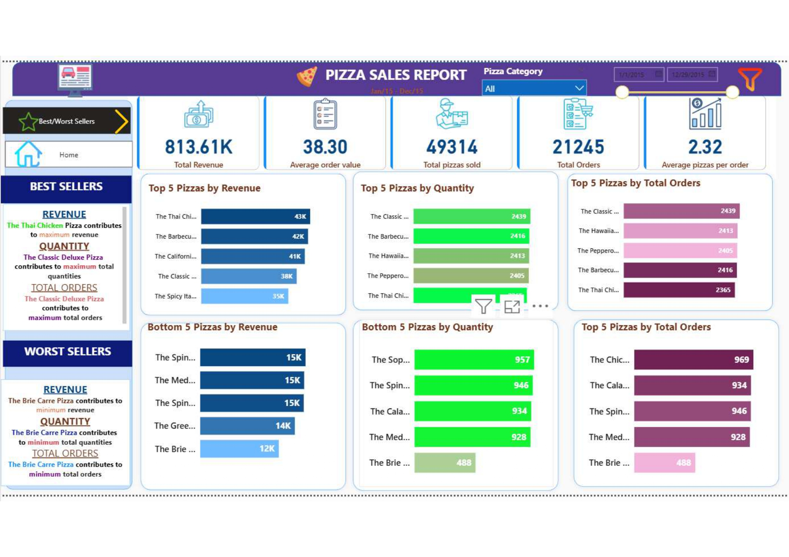

# 🍕 Pizza Sales Dashboard | Power BI

<p align="center">
  
  
  
  
</p>

---

## 📌 Project Overview

This project analyzes **Pizza Sales data** to uncover revenue trends, customer purchasing behavior, and product performance insights.

The interactive Power BI dashboard provides a comprehensive business view of sales performance and helps identify top-performing and underperforming products.

---

## 📊 Dashboard Pages

### 🏠 1️⃣ Sales Overview Dashboard

- 💰 Total Revenue  
- 🛒 Total Orders  
- 🍕 Total Pizzas Sold  
- 📊 Average Order Value  
- 📅 Daily Order Trends  
- 📆 Monthly Sales Trends  
- 📦 Sales Contribution by Category  
- 📏 Sales Contribution by Size  

### 📷 Preview



---

### ⭐ 2️⃣ Best & Worst Sellers Dashboard

- 🥇 Top 5 Pizzas by Revenue  
- 📦 Top 5 Pizzas by Quantity  
- 🛒 Top 5 Pizzas by Total Orders  
- 📉 Bottom 5 Pizzas by Revenue  
- 📉 Bottom 5 Pizzas by Quantity  
- 📉 Bottom 5 Pizzas by Total Orders  

### 📷 Preview



---

## 📈 Key Insights

- 🍕 Classic Category contributes the highest overall sales.
- 📏 Large size pizzas generate maximum revenue.
- 🥇 Thai Chicken Pizza is the top revenue performer.
- 📉 Brie Carre Pizza is the lowest-performing product.
- 📅 Weekends show higher order activity.
- 📆 July and January record peak monthly sales.

---

## 📊 Key KPIs

| Metric | Value |
|--------|--------|
| 💰 Total Revenue | 813K+ |
| 🛒 Total Orders | 21K+ |
| 🍕 Total Pizzas Sold | 49K+ |
| 📊 Average Order Value | 38.30 |
| 📦 Avg Pizzas per Order | 2.32 |

---

## 🛠 Tools & Technologies Used

- Power BI  
- SQL Server  
- DAX (Data Analysis Expressions)  
- Data Modeling  
- Business Intelligence Reporting  

---

## 📂 Project Structure

```
pizza-sales-sql-powerbi-project/
│
├── Pizza-Sales-Dashboard.pbix
├── Pizza_Sales_Business_Questions.pdf
├── pizza_sales_sql_queries.pdf
├── README.md
│
└── assets/
    ├── images/
    │   ├── overview_dashboard.jpg
    │   └── best_worst_dashboard.jpg
    │
    └── icons/
```

---

## 🎯 Business Impact

This dashboard enables:

- 📊 Performance monitoring  
- 📈 Revenue trend analysis  
- 📦 Product performance evaluation  
- 📅 Seasonal demand identification  
- 💡 Data-driven decision making  

It helps stakeholders quickly identify growth opportunities and optimize product strategy.

---

## 👨‍💻 Author

**Adharsh M**  
Aspiring Data Analyst  
Passionate about Data Analytics & Business Intelligence  

---

⭐ If you found this project useful, consider giving it a star!
